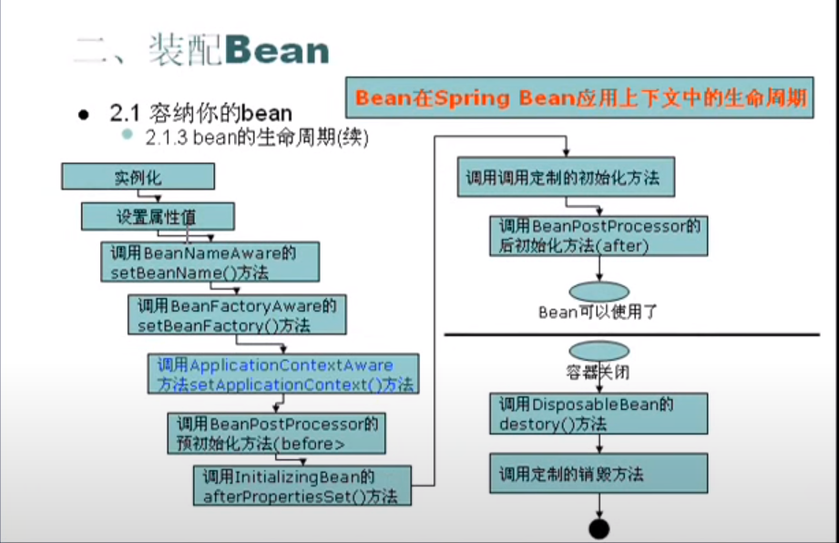
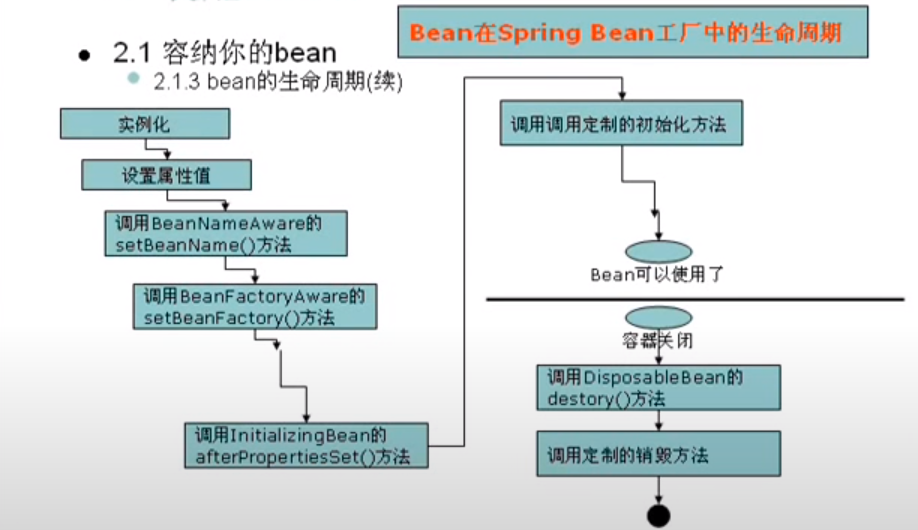

# Spring 从入门到放弃

*学习框架，关键就是学习每一个配置*

*代码位置：G:\master_courses\Learning_JavaEE\outside_Libs\mySpring*

---

## Spring 是什么
- struts是web框架(jsp/action/actionfrom)
- hibernate是orm框架，处于持久层
- spring是容器框架, 用于配置Bean并维护Bean之间关系的框架
  


由上图所示，spring 框架可以管理web层、业务层、dao层、持久层, 该spring可以配置各个层的组件(bean)，并且维护各个bean之间的关系

---
## 快速入门

###传统方法和spring的对比
1. 使用spring, 不需要new对象，我们把创建对象的任务交给了spring框架，我们只是get了创建好的对象
   
2. **Spring框架原理介绍** *(Spring框架如何被加载，Spring中配置的bean如何被创建，bean与bean之间的关系如何维护)*

*java代码*：
```java
ApplicationContext applicationContext = new ClassPathXmlApplicationContext("applicationContext.xml");
UserService userService = (UserService) applicationContext.getBean("userService");
userService.sayHello();
```
xml配置文件：
```xml
<bean id = "userService" class = "com.service.UserService">
    <property name = "name">
        <value> Siyu Liu</value>
    </property>
    <property name="byeService">
        <ref bean="byeService"/>
    </property>
</bean>

<bean id = "byeService" class = "com.service.ByeService">
    <property name="name" >
        <value>Poli Liu</value>
    </property>
</bean>
```
1. 当 ClassPathXmlApplicationContext()执行时，我们的spring容器对象被创建，同时applicationContext.xml中配置的bean就会被创建(类似于HashMap())，它的创建机制就是java的反射机制**
2. UserService userService = (UserService) applicationContext.getBean("userService") 就相当于map.get
3. userService.sayHello();

** 理论上，我们使用传统原理(dom4j + java反射机制)就可以还原出spring的工作原理:
   1. 遍历Bean，创建bean
   ```java
   userService = Class.forName("com.service.UserService");
   byeService = Class.forName("com.service.ByeService");
   // 根据这个方法我们可以知道，配置中的class必须写包名，而不是单纯的包
   ```

   2. 根据Bean的property的配置，开始赋值：
   ```java
   userService.setName("Siyu Liu"); 
   userService.setByeService(byeService);
   byeService.setName("Poli Liu);
   ```
   3. 将配置好的Bean打包送出去:
   ```java
   applicationContext = new HashMap<>();
   application.put("userService", userService);
   application.put("byeService", byeService);
   // 此处的每一个key其实对应的就是我们配置文件中的id
   ```
**总结上面案例：**

- Spring实际上是一个容器框架，可以配置各种bean，并且可以维护bean与bean的关系(ref)，当我们需要使用某个bean的时候，我们可以通过 *getBean(id)* 获取bean
- IOC:inverse of control，控制反转，所谓控制反转就是把创建对象(bean)和维护对象(bean)的关系的权力从程序中转移到Spring的容器中, 即配置文件 *applicationContext.xml*, 也就是我们不需要在程序中实现配置
- DI: dependency injection, 依赖注入，实际上di和IOC是同一个概念，可以用来更准确地表达spring核心技术

---

## 什么是bean？

bean 可以是java中的任何一种对象: javabean/service/action/数据源/dao。
关键概念：IOC(控制反转, Inverse of Control), di(dependency injection 依赖注入)
bean元素的作用是： 当我们的spring框架加载的时候，spring就会自动创建一个bean对象，并放入内存。
```xml
<?xml version="1.0" encoding="utf-8"?>
<!--  该部分是复制粘贴部分，无需自己写  -->
<!DOCTYPE beans PUBLIC "-//SPRING//DTD BEAN//EN"
        "http://www.springframework.org/dtd/spring-beans.dtd">
<beans>

<!--  在容器文件中配置bean(service/doa/domain/action/数据源)  -->
<!--  bean元素的作用是： 当我们的spring框架加载的时候，spring就会自动创建一个bean对象，并放入内存  -->
	<bean id = "userService" class = "com.service.UserService">
<!--   此处相当于调用了一个叫name的变量，并赋值给他，因此我们必须有set方法，否则不能调用     -->
<!--   id: 该对象的唯一标识，不能重复，如果使用类型获取bean可以省略id的赋值     -->
<!--   如果使用类型获取且获取bean在文件中有多个相同类型的存在，那么会报错     -->        
        <property name = "name">
            <value> Siyu Liu</value>
        </property>
        <!--    在userService里引用byeService bean    -->
        <property name="byeService">
            <ref bean="byeService"/>
        </property>
    </bean>
    
    <bean id = "byeService" class = "com.service.ByeService">
        <property name="name" >
            <value>Siyu Liu</value>
        </property>
    </bean>
    
</beans>
```

### Bean的作用域

创建一个Bean定义，其实质是用该bean定义对应的类来创建真正实例的 "*配方(recipe)*", Spring FrameWork支持五种作用域，这些作用域都是scope所控制的：

- **singleton**: 单态实例。在应用程序中，与容器同生同死。同时，随着ApplicationContext的加载而实例化，不管用户如何调用、多少次调用，我们使用的一直是唯一的一个bean
- **prototype**: 多态/原型实例。在应用程序中，多态实例不会随着ApplicationContext创建而实例化，而且每次创建的bean是不同的。使用prototype会对性能产生影响，除非必须，尽量避免使用多态
- **request**: 在一次Http请求中，一个bean定义对应一个实例，即每次Http请求会有各自的bean实例，他们依据某个bean定义创建而成。该作用域仅在基于web的Spring ApplicationContext情形下有效
- **session**: 会话实例。在一个Http session中，一个bean定义对应一个实例，**会话结束就会被抛弃**。该作用域仅在基于web的Spring ApplicationContext情形下有效
- **global session**: 在一个全局的Http session中，一个bean定义对应一个实例，**Spring容器失效才会被关闭**。该作用域仅在基于web的Spring ApplicationContext情形下有效

---

## 得到Bean

### 应用上下文(ApplicationContext)
上文提到的方法

### Bean 工厂 
**介绍**：工厂设计模式，创建分发各种bean, 配置好他们之间的协作关系，参与bean的生命周期，代码：
```java
BeanFactory bFactory = new XMLBeanFactory(new ClassPathResource("applicationContext.xml"));
```
beanFactory只把Bean的定义信息载进来，用的时候：```bFactory.getBean(id);``` 就可以得到一个Bean

### 二者的区别
- 当我们使用```ApplicationContext applicationContext = new ClassPathXmlApplicationContext("com/syl/ioc/beans.xml")```的时候，该配置文件中的所有被配置成singleton的bean都会被实例化。这样可以预先加载，但是消耗不必要的内存
- 当我们使用```BeanFactory beanFactory = new XmlBeanFactory(new ClassPathResource("com/syl/ioc/beans.xml"));```的时候，配置文件中的bean不会被实例化，只有当我们使用```getbean(id)```时才会被实例化，有点懒加载的意思。这样可以保证内存，但是可能会影响运行速度

**那么我们如何选择：** 当机器内存不足时，我们推荐使用*BeanFactory*, 一般情况，我们推荐使用 *ApplicationContext*

### 其他加载方法
**FileSystemXmlApplicationContext()**
通过文件路径来获取，用配置文件的绝对路径来获取，不推荐使用
**XmlWebApplicationContext()**
通过web系统中加载

---

## Bean的生命周期

#### ApplicationContext 的装配过程：
(*G:\master_courses\Learning_JavaEE\outside_Libs\mySpring\src\com\syl\beanlife*)

**Bean在ApplicationContext中的生命周期*

**第一步. 实例化:**
 - 当我们程序加载xml文件时，把我们的bean(默认是singleton)实例化到内存。
 - 这时候程序调用的其实是无参数的constructor(构造方法)；也就是说如果我们bean对应的类里没有构造方法，程序会调用默认的无参数构造方法
 - 如果bean对应的类里有一个有参数的构造方法，我们却还是使用原先的方法实例化bean，结果就是报错，因为我们这个有参constructor overload了原先默认的方法
 - 解决constructor有两个方法，一个是我们在class中写一个无参数的constructor; 另一个是我们在配置bean的时候添加一个```constructor-arg``` 属性, 并赋值

**第二步. 设置属性值：**
- 程序会寻找property.name对应的变量，并找到该变量的set方法，通过这个方法来赋值
- 如果没有找到对应变量或对应变量没有set方法，系统会报错。二者的错误信息提示相同 
  

**第三步. 调用BeanNameAware的setBeanName()方法:**
- BeanNameAware是一个接口，implement这个接口需要 ```@Override setBeanName(String str)```
- setBeanName(String arg0) 可以得到当前bean的id, 其中arg0就是id
  

**第四步. 调用BeanFactoryAware的setBeanFactory()的方法**
- BeanFactoryAware也是一个接口，implement这个接口需要 ```@Override setBeanFactory(BeanFactory beanFactory)```
- 调用上面的方法，可以获得当前beanfactory的信息并展示现在工厂内的bean，即使有的bean是prototype的，它也会被展示出来，只不过该bean没有被实例化

**第五步. 调用ApplicationContextAware的setApplicationContext()方法**
- 同样是接口。调用上面的方法可以获得当前ApplicationContext的信息

**第六步. 调用BeanPostProcessor的预初始化方法--** *postProcessBeforeInitialization*
- BeanPostProcessor也是接口，postProcessBeforeInitialization里有两个参数，一个是Object o, 另一个是String s
- Object o 对应的就是当前的bean，所以我们可以在这里对bean进行修改
- String s 对应的就是当前bean的id
- 如果想使用这个方法，推荐新写一个class来implements BeanPostProcessor, 然后xml文件中，新建一个bean并配置成当前class即可
  

**第七步. 调用InitializingBean的afterPropertyiesSet()**
- 如果你实现了InitializingBean接口，会调用afterPropertySet() 方法.
  

**第八步. 调用定制的初始化方法**
- 如果你想实现自己的一个初始化方法，需要在该bean中配置一个```init-method= _func_name```, 并在这个bean对应的实例中配置该方法

**第九步. 调用BeanPostProcessor的后初始化方法--** *postProcessAfterInitialization*
- postProcessAfterInitialization里有两个参数，一个是Object o, 另一个是String s
- 使用方法与第六步相同，当我们使用BeanPostProcessor时，两个方法同时需要*Override*
  

**第十步. bean编译完毕**

**第十一步. 容器关闭，调用DisposableBean的destroy() 方法**
- 不推荐使用。

**第十二步. 调用定制的销毁方法**
- 想要使用自己写的销毁方法，首先在bean里添加```destroy-method=_func_name```属性，并在对应的class中配置*_func_name*函数

我们常见的步骤是：**1->2->6->10->11(不包括销毁方法)**

#### BeanFactory的装配过程：

**Bean在BeanFactory中的生命周期*
对比两个的程序的输出结果：
| ApplicationContext             | BeanFactory                        |
| ------------------------------ | ---------------------------------- |
| constructing...                | constructing...                    |
| setting property name: name... | setting property name: name...     |
| Setting bean name...           | Setting bean name...               |
| Setting bean factory...        | Setting bean factory...            |
| Setting ApplicationContext...  | 我们没有使用ApplicationContext方法 |
| Before Initialization...       |                                    |
| Initializing Bean...           | Initializing Bean...               |
| my own init method             | my own init method                 |
| After Initialization...        |                                    |
| hi, Siyu Liu                   | hi, Siyu Liu                       |

---

## 装配Bean

### 使用xml装配
xml是最常见的spring应用系统配置源
几种spring容器都支持使用xml装配bean，包括：
- XmlBeanFactory：调用ClassPathResource载入上下文定义文件(applicationContext.xml)
- ClassPathXmlApplicationContext：从类路径载入上下文定义文件
- XmlWebApplicationContext: 从web应用上下文中载入定义文件

上下文定义文件的根元素是`<beans>`, `<beans>`有很多个`<bean>`子元素。每个`<bean>`元素定义了一个bean如何装配到spring容器中
```
<beans>
    <bean id = 'a' class = '...A'></bean>
    <bean id = 'b' class = '...B'></bean>
</beans>
```
对bean最基本的配置包括bean的ID和它的全称类名

### 属性scope:
[scope详解](#bean的作用域)

### 实例化与销毁
spring实例化bean或销毁bean时，有时需要做一些处理工作，因此spring可以在创建和拆卸bean的时候使用两个生命周期方法: `init-method` & `destroy-method`
[实例化与销毁](#applicationcontext-的装配过程)
<del>我们也可以在对应类里使用注解的方式来是实现这两个功能, 记得要引入`import javax.annotation`
`@PostConstruct` 用于实例化
`@PreDestroy` 用于销毁</del>
上面的方法不太对，没有实现成功

### 通过set方法注入依赖
*(./mySpring/src/com/syl/collections)*
`<bean>`元素的`<property>`子元素指明了使用他们的*set*方法来注入。**可以注入任何东西，从基本类型到集合类，甚至是应用系统的bean**
- **简单的赋值注入**
    - 通过在`<property>`中使用`<value>`来为bean配置
- **bean与bean的注入**
  - 外部bean引用：通过在 `<property>` 中使用`<ref>`来把其他已经配置好的bean引入到需要的bean中
  - 内部bean应用：通过在 `<property>` 中使用`<bean>` 来配置一个新的bean，该bean只能用于此处，其他外部bean不能访问
  - 继承bean: 通过在`<bean>`中使用`<parent>`属性，继承父类bean。子类可以覆盖父类。
- **集合注入(Map, List, Array, Set)**
  - Array(数组) / List(列表)：在`<property>`的`<list>`中添加`<value>`
  - Set: 在`<property>`的`<set>`中添加`<value>`
  - Map: 在`<property>`的`<map>`中添加`<entry key =''>`, 在entry下添加`<value>`
  
### 通过构造方法constructor来注入
bean 设置：
```
<bean id = "emp0" class="com.syl.constructor.Emloyee">
    <constructor-arg index="0" type="java.lang.String"><value>Tecj</value></constructor-arg>
    <constructor-arg index="1" type="int"><value>30</value></constructor-arg>
</bean>
```
Emloyee 代码：
```
public class Emloyee {
    private String name;
    private int age;

    public Emloyee() {
    }

    public Emloyee(String name, int age) {
        this.name = name;
        this.age = age;
    }
...
}
```
使用set的缺点时无法清晰表达哪些属性是必须的，那些是可选的
使用constructor可以构造强制依赖关系，不可能实例化不完全或无法使用的bean
** *如果属性是类属性，可以使用 `ref`*

### 自动装配
Spring IOC容器可以 *自动装配(autowire)* 相互协作bean之间的关联关系。因此，如果可能的话，可以自动让Spring通过检查BeanFactory中的内容，来替我们指定bean的协作者(其他被依赖的bean)。
由于autowire可以针对单个bean进行设置，因此可以让有些bean使用autowire，有些bean不采用。
autowire的方便之处在减少或者消除属性的构造器参数设置，这样可以给我们的配置文件 “*减肥* ”

autowire一共有五种类型：
| 模式        | 类型                                                                                                                                                                                                                                         |
| ----------- | -------------------------------------------------------------------------------------------------------------------------------------------------------------------------------------------------------------------------------------------- |
| no          |                                                                                                                                                                                                                                              |
| byName      | 根据属性名自动装配。此选项将检查容器并根据名字查找与属性完全一致的bean，并将其与属性自动装配                                                                                                                                                 |
| byType      | 如果容器存在一个与指定属性类型相同的bean，那么将于该属性自动装配。如果存在多个该类型的bean，那么将会抛出异常；如果没有找到相匹配的bean，则什么事都不会发生，为了避免这种情况发生，我们需要设置`dependency-check = "objects"`让Spring抛出异常 |
| constructor | 与byType相似，不同之处在于他应用与构造器参数。如果在容器中没有找到与构造器参数类型一致的bean，那么将会抛出异常                                                                                                                               |
| autodetect  | 通过bean类的自省机制(introspection) 来决定使用constructor 或是byType方式进行自动装配，如果发现默认的构造器，那么将使用byType方式                                                                                                             |

- byName: 使用`autowire="byName"`,Spring会去找beanFactory中有没有一个bean的id和需求bean正好相同。如果有就装配成功，如果没有报错，如果有一个和需求类相同但是id不是需求bean对应的类名，也会视为找不到
- byType: 使用`autowire="byType"`, Spring会去找BeanFactory中有没有一个bean的类型和需求bean正好相同，如果有且有一个就会装配成功，如果有多个相同bean，会报错
- constructor: 使用`autowire = "constructor"`. 
  - 必须保证只有一个含参constructor，且参数仅为bean对应
  - 如果有多个可做参数的bean，报错

### Properties装配(分散配置)

`<context:property-placeholder location="classpath:com/syl/property/stu1.properties, classpath:com/syl/property/stu2.properties "/>`
在beans里添加这个就可以使用properties来装配。
- 每多一个properties文件，在location里添加一个路径
- ``` 
  <bean id="stu2" class="com.syl.property.Student" >
        <property name="id" value="${Id}"/>
        <property name="first_name" value="${first_name}"/>
        <property name="last_name" value="${last_name}"/>
        <property name="age" value="${age}"/>
    </bean>
  ```
    这里的$是标识符。{}里包括的是properties文件中的key    
  

---
## AOP编程 (aspect oriented programming)
面向切面(方面)编程，是对所有对象或者是一类对象编程，核心是 **不再增减代码的基础上，增加新功能**

### 通知
| 通知类型 | 接口                                         | 概述                     |
| -------- | -------------------------------------------- | ------------------------ |
| Around   | org.aopalliance.intercept.MethodInterceptor  | 拦截对目标方法调用       |
| Before   | org.springframework.aop.MethodBeforeAdvice   | 在目标方法调用前调用     |
| After    | org.springframework.aop.AfterReturningAdvice | 在目标方法调用后调用     |
| Throws   | org.springframework.aop.ThrowsAdvice         | 当目标方法抛出异常时调用 |
| 引入通知 |                                              |                          |

**编程说明**
定义接口 >> 编写对象(目标对象) >> 编写通知 >> beans.xml文件配置 
```
<!--  配置对象  -->
    <bean id = "test1Service" class="com.aop.Test1Service">
        <property name="name" value="Johnson" />
    </bean>

<!--  配置前置通知  -->
    <bean id ="myMethodBeforeAdvice" class="com.aop.MyMethodBeforeAdvice"/>

<!--   配置代理对象 -->
    <bean id = "proxyFactoryBean" class="org.springframework.aop.framework.ProxyFactoryBean">

    <!--    代理接口集    -->
        <property name="proxyInterfaces">
            <list>
                <value>com.aop.TestServiceInt</value>
                <value>com.aop.TestServiceInter2</value>
            </list>
        </property>
    <!--    把通知置入到代理对象中   -->
        <property name="interceptorNames">
    <!--    相当于把 myMethodBeforeAdvice和代理对象关联起来
           可以把通知看作拦截器  -->
            <list>
                <value> myMethodBeforeAdvice </value>
                <value>另一个method的id</value>
            </list>
        </property>
    <!--    配置需要被代理的对象        -->
        <property name="target">
            <ref bean="test1Service" />
        </property>
    </bean>
```
引入通知：
```
<bean id = "myBeforeAdvice" class = "org.springframework.aop.support.NameMatchMethodPointcutAdvisor">
    <property name="advice" ref="myMethodBeforeAdvice"/>
    <property name="mappedNames">
        <list>
            <value>sayHello</value> // 这里是你希望切入的位置
        </list>
    </property>
</bean>
```